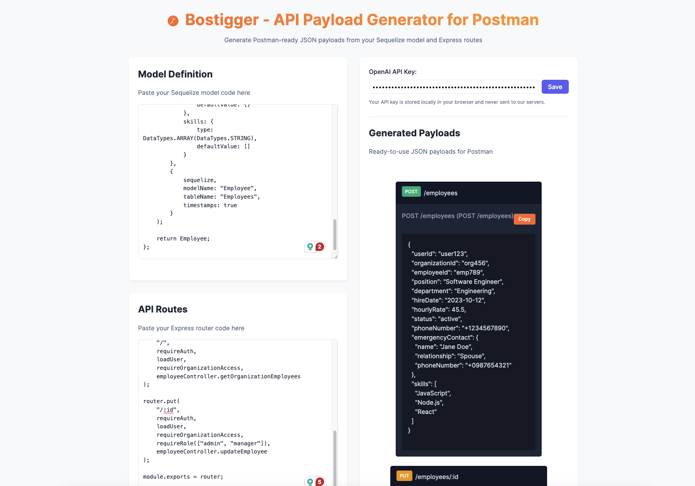

# API Payload Generator for Postman

A web application that generates Postman-ready JSON payloads from your Sequelize models and Express routes using OpenAI's GPT-3.5 model.



## Features

- **Dynamic Payload Generation**: Analyzes your Sequelize models and Express routes to create accurate JSON payloads
- **OpenAI Integration**: Uses GPT MODEL to intelligently generate sample data based on your code
- **Postman-Ready**: Copy payloads directly to clipboard and paste into Postman
- **Local Processing**: Your model and route code is only sent to OpenAI, not stored anywhere else
- **Clean UI**: Minimalist interface focused on the generated payloads

## Setup

### Quick Start

1. Clone the repository:
   ```bash
   git clone https://github.com/yourusername/api-payload-generator.git
   cd api-payload-generator
   ```

2. Open `index.html` in your browser.

3. Enter your OpenAI API key.

4. Paste your Sequelize model and Express routes code.

5. Click "Generate Postman Payloads".

### Requirements

- An OpenAI API key (get one at [OpenAI Platform](https://platform.openai.com/))
- A modern web browser (Chrome, Firefox, Safari, Edge)
- Internet connection (to call the OpenAI API)

## How It Works

The application:

1. Takes your Sequelize model code to understand your data structure
2. Analyzes your Express routes to identify API endpoints
3. Sends this information to the OpenAI GPT-3.5 model
4. Processes the response to extract JSON payloads
5. Presents the payloads in a clean, copyable format

## Usage Tips

### Model Code

- Paste your complete Sequelize model file including attributes, associations, and options.
- Ensure field types, validations, and required fields are clearly defined for best results.

### Routes Code

- Paste your Express router code with routes and middleware.
- Comments above routes (like `// CREATE USER`) help the AI understand the purpose of each endpoint.

### API Key

- Your OpenAI API key is stored in your browser's localStorage and is never sent to our servers.
- You can remove it at any time by clearing your browser storage.

### Customization

- The generated payloads are intelligent suggestions - feel free to modify them for your specific needs.
- Field values are created based on field names and types, with common patterns recognized.

## Troubleshooting

### Common Issues

- **"API call failed"**: Check that your OpenAI API key is valid and has sufficient credits.
- **No payloads generated**: Ensure your model and routes code is complete and follows standard patterns.
- **Incorrect field types**: Make sure your Sequelize model clearly defines field types.

### API Rate Limits

Be aware that OpenAI has rate limits on their API. If you're generating many payloads, you might hit these limits.

## Privacy

- Your code is only sent to OpenAI's API for payload generation.
- The application doesn't store your code or API key on any server.
- Your API key is stored in your browser's localStorage for convenience.

## License

This project is licensed under the MIT License - see the LICENSE file for details.

## Contributing

Contributions are welcome! Please feel free to submit a Pull Request.

1. Fork the repository
2. Create your feature branch
3. Commit your changes
4. Push to the branch
5. Open a Pull Request

## Acknowledgments

- OpenAI for providing the GPT-3.5 model API
- The Sequelize and Express.js communities for their documentation

---

Built with ❤️ for API developers